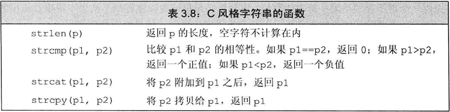

## 注意：

- 尽量不要使用！极易引发程序漏洞
- 字符串字面值是C风格字符串
- **C风格字符串中间可以包含空字符\0，但是输出的显示效果\0不占空间，即本应该是{'a','b','\0','c'}，输出后显示效果为abc**
- C风格字符串不是一种类型，只是一种写法。此种写法的字符串存放在字符数组中，并且以空字符\0结束，一般利用指针操控这些字符串
- **C风格字符串函数的参数必须是指向以空字符\0结束的字符数组的指针，换成其他空字符比如空格、制表符，或者不要空字符也能正常运行，但是输出的结果不正常，因为会一直沿着数组在内存中的位置向前寻找直到遇到空字符\0才停止**

```c++
char ca[] = {'z','x','m'};//普通字符数组
char ca2[] = {'l','q','m','\0'};//C风格字符串数组
cout << strlen(ca);//错误！ca不是C风格字符串
cout << strlen(ca2);//正确！输出3，因为不包括空字符
cout << strlen("zxm");//正确！字符串字面值属于C风格字符串，输出3
```

- 使用strcat和strcpy函数时，必须提供一个足够以便容纳结果字符及末尾空字符的字符数组



## 与旧代码的接口：

**一般情况下，任何穿线字符串字面值的地方都能用以空字符结束的字符数组来替代：**

- **允许使用以空字符结束的字符数组来初始化string或者为string赋值**
- **在string对象的加法运算中，允许使用以空字符结束的字符数组作为其中一个运算对象**

**但是反过来就不成立了，如果某处需要一个C风格字符串，我们不能用string代替**

**函数c_str，接受一个string，返回一个C风格字符串，即一个指针，该指针指向一个以空字符结束的字符数组，内容与string一致。该指针类型为const char\*。通常，后续操作改变了原string的话，该指针也失效了。如果后续想要使用这样内容的数组，最好重新拷贝一份**
