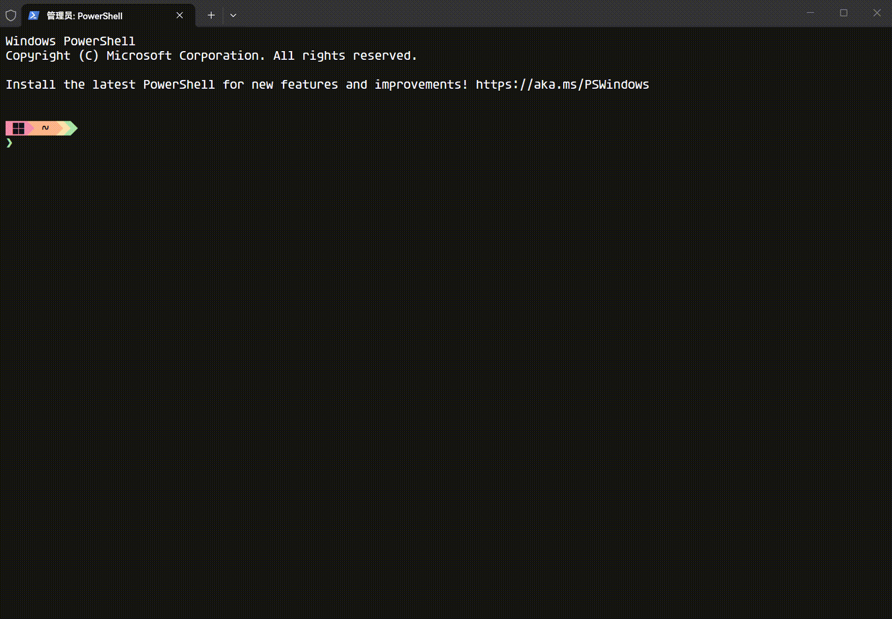
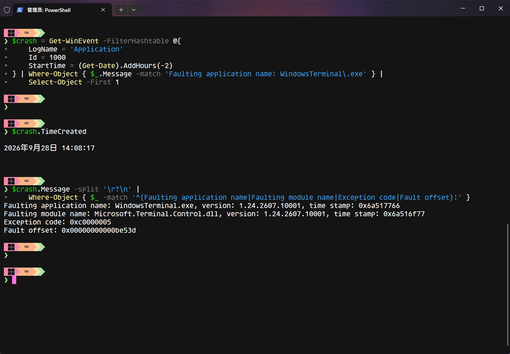

## 问题描述

在 Windows Terminal 的 PowerShell 标签页里执行 `Test-NetConnection`，窗口会突然消失。有时其他已打开的 Terminal 窗口也会一起关闭。

起初我以为是 PowerShell 退出；后来查看系统日志，才发现崩溃的是 Windows Terminal。



## 环境

- Windows Terminal：
  
- PowerShell：
  
- Windows：
  

## 从一条命令开始

最初触发问题的是这条网络测试命令。目标 IP 已放入环境变量，避免截图时暴露地址：

```powershell
Test-NetConnection $env:TARGET_IP -Port 443 -InformationLevel Detailed
```

我换了几个运行位置做对照：

| 运行位置                                                                     | 结果     |
| ---------------------------------------------------------------------------- | -------- |
| Terminal 的 PowerShell 标签页                                                | 崩溃     |
| 在上述标签页中启动 `powershell.exe -NoProfile`                               | 崩溃     |
| 原生 PowerShell 窗口                                                         | 正常返回 |
| Terminal 的 CMD 标签页中启动交互式 `powershell.exe -NoProfile`               | 正常返回 |
| Terminal 的 CMD 标签页中通过 `powershell.exe -NoProfile -Command "..."` 执行 | 正常返回 |


这里有个容易误判的地方：在**已经打开的 PowerShell 标签页**中运行 `powershell.exe -NoProfile`，只能阻止子进程加载配置，不能抹掉父会话此前对这个标签页造成的影响。因此，这一步并没有排除 PowerShell 启动配置。

## 确认是谁崩溃了

Windows 应用程序错误日志给出了明确记录：

```text
Faulting application name: WindowsTerminal.exe
Faulting module name: Microsoft.Terminal.Control.dll
Exception code: 0xc0000005
```

也就是说，窗口不是因为 PowerShell 正常退出而关闭的；发生访问冲突的是 Windows Terminal 进程。不过，这份日志还不能直接说明是什么触发了崩溃。



## 排除几个直观的猜测

我先试了目标地址和输出方式。换成回环地址、丢弃输出，或把结果存进变量，都出现过崩溃：

```powershell
Test-NetConnection 127.0.0.1 -Port 443 -InformationLevel Detailed
Test-NetConnection 127.0.0.1 -Port 443 -InformationLevel Detailed | Out-Null
$result = Test-NetConnection $env:TARGET_IP -Port 443 -InformationLevel Detailed
```

所以问题既不局限于某个远端 IP，也不是简单地由结果打印在屏幕上造成的。

接下来，我在会崩溃的会话中关闭 PowerShell 进度显示：

```powershell
$ProgressPreference = 'SilentlyContinue'
```

这次命令正常返回了。这是一个可用的临时规避办法，但它会隐藏当前会话中其他命令的进度信息。


## 渲染设置没有解决问题

原配置指定了：

```json
"rendering.graphicsAPI": "direct3d11"
```

我备份配置，移除这一项，关闭所有 Terminal 窗口后重新测试：**仍然崩溃**。

随后改用软件渲染：

```json
"experimental.rendering.software": true
```

结果也一样。至少对这次问题而言，单独调整这两项渲染设置没有效果。

## 字体和 Starship

恢复原配置后，我只把字体改为 `Cascadia Mono`。重启 Terminal，反复执行同一条命令，都能正常返回。

原先使用 `Agave Nerd Font`，主要是为了显示 Starship 提示符。我去掉原配置中的另一种字体，只保留 `Agave Nerd Font`，崩溃仍会出现。于是继续保持 Agave 不变，**只停用 PowerShell 中的 Starship 初始化**：命令也正常返回了。

最终得到的对照是：

| 字体            | Starship | 结果          |
| --------------- | -------- | ------------- |
| Agave Nerd Font | 启用     | Terminal 崩溃 |
| Agave Nerd Font | 停用     | 正常返回      |
| Cascadia Mono   | 启用     | 正常返回      |

停用 Starship 后的测试：


启用 Starship 时的测试：


## 结论

在我的环境里，**Agave Nerd Font 与 Starship 同时使用时，可以稳定复现这次崩溃**。换成 `Cascadia Mono`，或者保留 Agave、停用 Starship，都能让命令正常返回。

我最终将问题排查到这个组合，没有继续追踪具体是哪段提示符输出、哪个字形或 Terminal 的哪处处理逻辑触发了访问冲突。因此，这里不能简单地说“字体坏了”或“Starship 本身有问题”。

如果遇到相似现象，我会先查应用程序错误日志，确认究竟是谁崩溃；再分别停用提示符工具、更换字体做对照。比起一开始就重装 Terminal，这次这些对照测试更快地找到了可用的解决办法。
