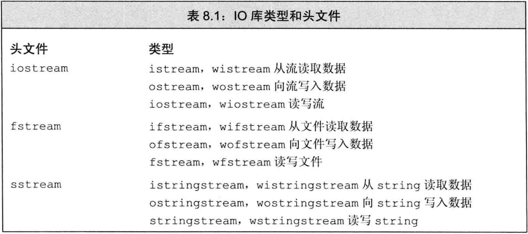
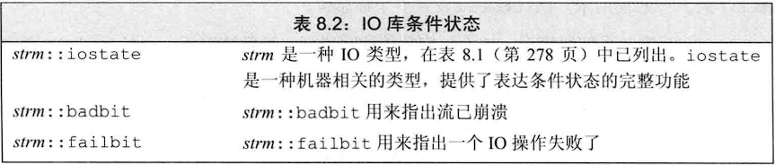
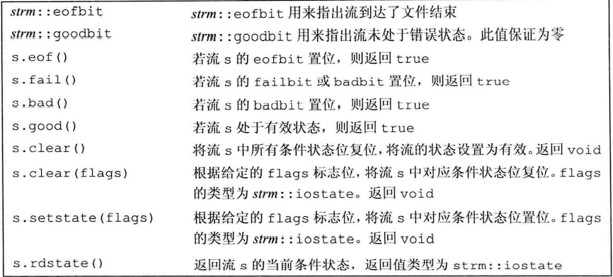
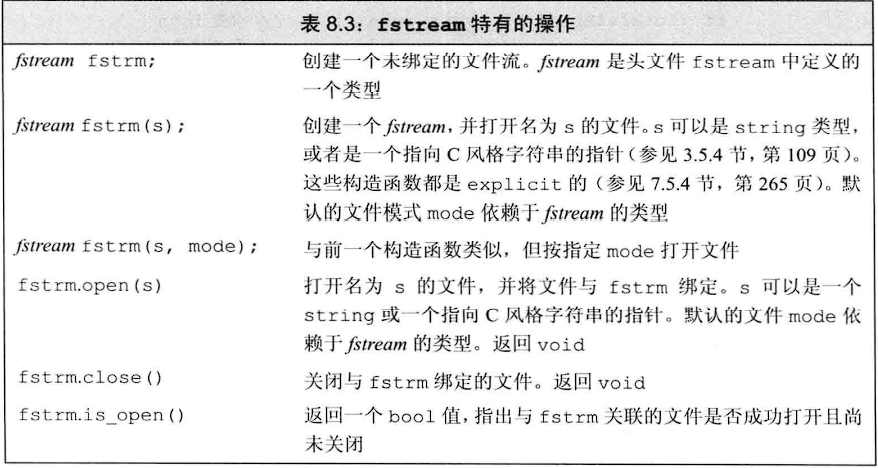
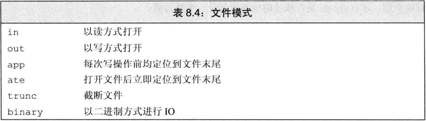
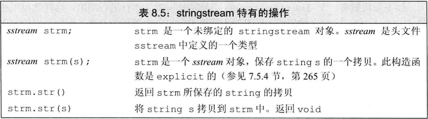

## 注意：

- **C++语言不直接处理输入输出，而是通过一组定义在标准库中的类型来处理IO**
- **内存IO：即从string中读取数据，向string中写入数据**
- **IO对象无拷贝或赋值**
- **确定一个流对象****是否处于有效状态最好办法就是将它作为条件使用**
- **如果程序崩溃，输出缓冲区不会被刷新！！！**
- **类型ifstream和istringstream都继承自istream。类似的，ofstream和ostringstream都继承自ostream**
- **拷贝新的string给istringstream对象不会刷新状态！**

## 流的状态

**IO库定义的四个iostate类型都是constexpr的值来表示流的状态**

**badbit表示系统级错误，如不可恢复的读写错误。通常情况下，一旦badbit置位流就无法使用了**

**failbit表示可恢复错误，比如期望读取一个int却输入了一个char，这种问题通常是可以修正的，流还可以继续使用**

**如果到达文件结束位置，eofbit和failbit都会置位**

**goodbit为0表示流为出错**

**badbit、failbit、eofbit中任意一个置位流状态检测都为false**

**使用good()或者fail()是确定流总体状态的正确方法。实际上，把流当作条件使用的代码等价于使用!fail()，而eof和bad()操作只能表示特定的错误**

## 输出缓冲区

**每个输出流都管理一个缓冲区，用来保存程序读写的程序**

有了缓冲机制，操作系统就可以将程序的多个输出操作组合成单一的系统级写操作

由于设备的写操作可能很耗时，**允许操作系统将程序的多个输出操作组合成单一的系统级写操作可以带来很大的性能提升**

**使用flush刷新缓冲区不带任何额外字符；ends向缓冲区插入一个空字符****（VS2022中测试，此空字符不占任何显示空间）****，然后刷新缓冲区**

**使用unitbuf操纵符可以让流对象每次写操作后都进行一次flush操作。而nounitbuf操纵符则重置流，使其恢复正常的系统管理的缓冲区刷新机制**

**如果程序崩溃，输出缓冲区不会被刷新！！！**

**当一个输入流和输出流关联在一起时，任何试图从输入流读取数据的操作都会先刷新关联的输出流**

### 能导致缓冲区刷新的操作：

- 程序正常结束，作为main函数的return操作的一部分，缓冲刷新被执行
- 缓冲区满时，需要刷新缓冲，而后新的数据才能继续写入缓冲区
- 使用操纵符例如endl、flush、ends显式刷新缓冲区
- 在每个输出操作后，我们可以用操纵符unitbuf设置流的内部状态，来清空缓冲区。默认情况下，对cerr时设置unitfuf的，因此写到cerr的内容都是立即刷新的
- 一个输出流可能被关联到另一个流。在这种情况下，当读写被关联的流时，关联到的流的缓冲区会被刷新。例如默认情况下，cin和cerr都关联到cout。因此，读cin或写cerr都会导致cout的缓冲区刷新

### 关联输入和输出流：

**tie函数是输入流的成员函数。有两个版本：**

**无参数版本：返回指向所关联的输出流的指针，如果没有关联到任何输出流，则返回空指针**

**有参数版本：接受一个指向输出流的指针，将自己关联到该对象。例如x.tie(&o)就是将输入流x关联到输出流o**

**每个输入流最多关联一个输出流，但是多个输入流可以关联到同一个输出流**

## 文件输入与输出

当创建文件流对象时，**如果提供了文件名（需要加后缀），则open会自动被调用**

**如果调用open失败，failbit就会置位，**进行open是否成功的检测是一个好习惯

**对于一个已经打开的文件流调用open就会失败，导致failbit置位，随后试图使用文件流的操作都将失败**

**如果要更改文件流的文件关联，必须首先关闭已经关联的文件！**

**如果open成功，则open会设置流的状态，使得good()为true**

**当一个fstream对象被销毁时，close会自动调用（即自动析构）**

### 文件模式

指定文件模式时有以下限制：

- ifstream对象不能设定out模式
- ofstream对象不能设定in模式
- 只有当out也被设定时才能设定trunc模式
- 只要trunc没被设定，就可以设定app模式。在app模式下，即使没有显示指定out模式，文件也总是以输出方式被打开
- 默认情况下，即使我们没有指定trunc，以out模式打开的文件也会被截断。为了保留以out模式打开的文件的内容，我们必须同时指定app模式，这样只会将数据追加到文件末尾；或者同时指定in模式，及打开文件同时进行读写操作（P676）
- ate和binary模式可用于任何类型的文件流对象，且可以与其他任何文件模式组合使用

**以out模式打开文件会丢弃已有数据！阻止清空文件的办法是追加app模式或者in模式！**

**追加多个模式使用分隔符（ | ）**

**每次调用open就会确定文件模式**

