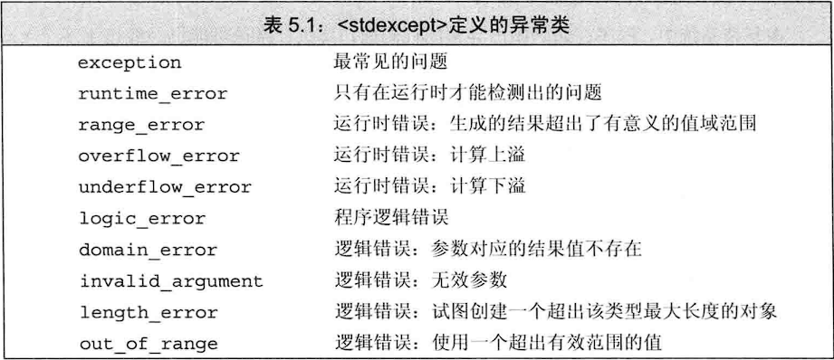

## 注意：

- **new头文件中bad_alloc，type_info头文件中bad_cast未看**
- **标准库异常只定义了几种运算，包括创建或拷贝异常类型的对象，以及为异常类型的对象赋值**
- **只能以默认初始化的方式初始化exception、bad_alloc、bad_cast对象，不允许为这些对象赋值，其他异常类型的对象则必须使用C风格字符串或者string对象初始化，不允许使用默认初始化！**
- **异常类型只定义了一个what成员函数，这个函数没有任何参数，返回值是一个指向C风格字符串的const char\*。该字符串目的是提供关于异常的文本信息（即异常的初始值），对于无初始值的异常类型，返回的内容由编译器决定**

