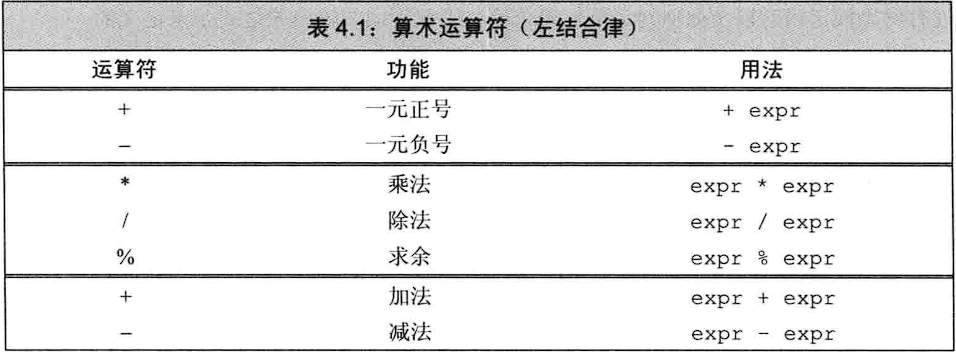
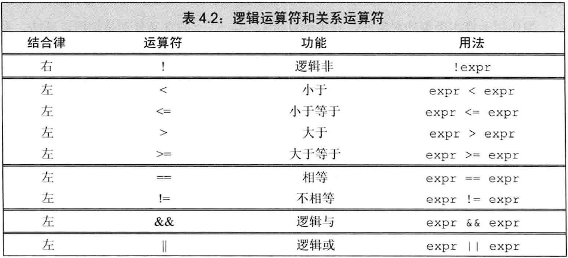
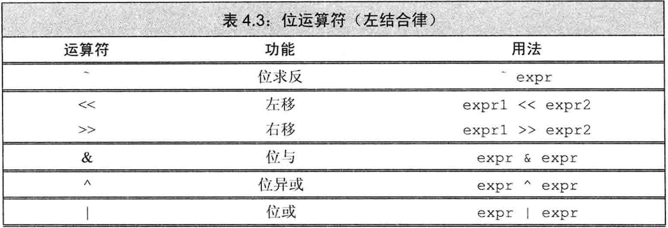

## 注意：

- **结合律问题还是没有搞懂**
- **左值与右值：当一个对象被用作右值的时候，用的是对象的值（内容）；被用作左值时，用的是对象的身份（在内存中的位置）**
- **算数表达式是一个右值**
- **只有四种运算符规定了运算对象的求值顺序：逻辑与（&&）、逻辑或（||）、条件（?:）和逗号（,）**
- **对于没有指定执行顺序的运算符来说，如果表达式指向并修改了同一对象，将会引发错误并产生未定义的行为**

```c++
//输出运算符并没有规定执行顺序
cout << i <<" "<< ++i;//未定义的代码，因为无法确定先求i的值还是++i的值
```

## 算数运算符：



**算数运算符的运算对象和结果都是右值**

**当一元正好作用于指针或者算术值时，返回运算对象值的一个（提升后的）副本**

**整数相除结果还是整数，直接舍弃小数部分**

**取余（取模）运算的运算对象必须是整数**

**在取余运算中，新标准规定不匹配（忽略）除数的符号！即m%(-n)等于m%n，(-m)%n等于-(m&n)**

## 逻辑和关系运算符：



**逻辑运算符和关系运算符的返回结果都是bool类型**

**运算对象和结果都是右值**

**逻辑运算符采用短路求值策略：当且仅当左侧运算对象无法确定表达式的结果时才会计算右侧运算对象的值**

- 对于逻辑与&&来说，当且仅当左侧运算对象为真时才计算右侧运算对象
- 对于逻辑或||来说，当且仅当左侧运算对象为假时才计算右侧运算对象

**要注意几个关系运算符连用的情况！因为关系运算符返回布尔值，第二个运算符将会使用布尔值与右侧对象进行比较！**

**进行比较运算时，除非运算对象是bool类型，否则不要用布尔字面值true或者false作为运算对象**

```c++
//如果val不是bool类型，比较之前会先把true转化为val的类型。因此也就失去了原来的意义
if(val == true)
//正确写法是缩写或者用1代替true
if(val)
if(val == 1)
```

## 赋值运算符：

**满足右结合律！！！**

**赋值语句作为条件为真！**

**优先级一般比较低**

左侧运算对象必须是可修改的左值

初始化并非赋值！

**运算的结果是左侧运算对象，并且是一个左值**

如果两侧运算对象类型不一，将右侧对象类型转化为左侧对象的类型

**右侧运算对象允许使用花括号括起来的初始值列表，但是如果存在丢失信息的风险，则行为未定义**

**无论左侧对象类型是什么，都可以使用一个空的花括号作为右侧对象，此时编译器会创建一个值初始化的临时量并赋值给左侧对象**

**复合赋值运算符（+=等）值求职一次，而普通赋值运算符求值两次。复合赋值运算符对程序性能有着微乎其微的影响**

## 递增和递减运算符：

**前置版本：**先将运算对象加1（减1）后将改变过的对象作为求值结果，返回的是左值

**后置版本：**先返回运算对象的副本，再将运算对象加1（减1），返回的是右值

都必须作用于左值对象

后置版本需要先将原始值存储下来以便于返回这个未修改的值。**除非必须，否则不用后置版本**

## 成员访问运算符：

**解引用运算符优先级低于点运算符**，所以一些语句中要注意加上括号

**箭头运算符作用与指针类型，返回结果是一个左值**

**使用点运算符时如果成员所属对象是左值则返回左值，如果成员所属对象是一个右值则返回右值**

## 条件运算符：

只对两个结果表达式中的其中一个求值并返回

**两个结果表达式都是左值或者都能转换成同一种左值类型时，运算的结果是左值；否则运算的结果是右值**

**条件运算符优先级特别低，放在长表达式中一定要加括号！**

**满足右结合律！**

## 位运算符：



**作用于整数类型和bitset的运算对象，并把运算对象看成是二进制位的集合**

**一般来说，如果运算对象是小整型，则它的值会被自动提升成较大的整数类型**

**运算对象对带不带符号不做要求，但是如果带符号且为负数，那么位运算符如何处理对象的”符号位“依赖于机器。而且此时左移操作可能会改变符号位的值，因此是一种未定义的行为**

**强烈建议仅将位运算用于处理无符号类型**

### 移位运算符：

移除边界外的位被舍弃掉了

返回的是左侧对象的值副本运算后的结果，左侧对象本身未改变

### 位求反运算符：

返回的是左侧对象的值副本运算后的结果，左侧对象本身未改变

### 位与、位或、位异或运算符：

**位与（&）：**如果两个运算对象的对应位置都是1则运算结果中该位为1，否则位0

**位或（|）：**如果两个运算对象的对应位置至少有一个为1则运算结果中该位为1，否则为0

**位异或（^）：**如果两个运算对象的对应位置有且只有一个1则运算结果为中改为为1，否则为0

支持复合赋值运算

### sizeof运算符：

返回一条表达式或者一个类型名字所占的**字节数**，**类型为size_t的常量表达式**

**满足右结合律**

**sizeof并不实际计算运算对象的值。因此，在sizeof中解引用一个无效指针也不会产生错误，因为指针实际上没有被真正使用**

**使用sizeof计算数组时，数组名不会转换为指针！**

**对string对象或vector对象执行sizeof只返回该类型固定部分的大小，不会计算对象中的元素占用了多少空间**

### 逗号运算符：

最终求值结果是左侧表达式的值

若右侧运算对象是左值，那么最终的求值结果也是左值
