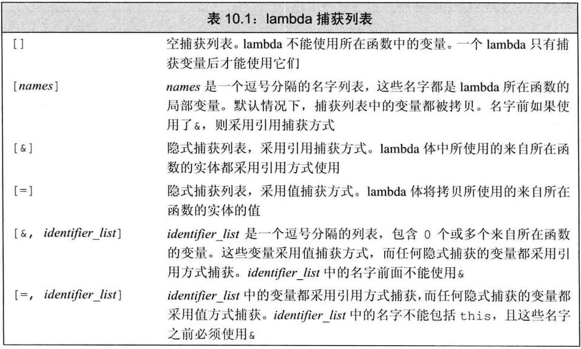

## 注意：

- **当省略返回类型时，如果函数体中仅有一条return语句，可以根据return语句推断出返回类型；若函数体还有其他语句，则返回类型为void**
- **当定义一个lamdba时，编译器生成了一个对应的新的（未命名的）类类型**
- **当向函数传递一个lambda时，同时定义了一个新类型和该类型的对象。类似的，当使用auto定义一个用lambda初始化的变量时，也就是定义了一个lambda生成的类型的对象**
- **默认情况下，从lambda生成的类都包含一个对应该lambda所捕获的变量的数据成员。类似于普通类的数据成员，lambda的数据成员也在对象创建时被初始化**

## 可调用对象：

如果一个对象或一个表达式能够使用调用运算符，那么它就是可调用对象。比如函数、函数指针、重载了调用运算符的类、lambda表达式

## lambda简介：

lamdda表达式表示一个可以调用的代码单元，**可以将其理解为一个未命名的内联函数**

**lambda表达式可以定义在函数内部**

**lambda表达式一般形式为：[ 捕获列表 ] ( 参数列表 ) -> 返回类型 { 函数体 }**

**lambda表达式必须使用尾置返回**

**可以忽略参数列表和返回类型，但是必须永远包含捕获列表和函数体！**

```c++
auto f = []{return 10;};//一条lambda语句，f为可调用的lambda对象，省略了参数列表和返回类型（尾置返回符号->时返回类型的一部分）
```

**当省略返回类型时，如果函数体中仅有一条return语句，可以根据return语句推断出返回类型；若函数体还有其他语句，则返回类型为void**

**lambda表达式不能有默认参数！！！**

## 捕获：

**lambda表达式出现在一个函数中，但不能使用其全部的局部变量，只能使用那些明确指明的变量的。lambda表达式将局部变量包含在捕获列表中以指明这些变量将会被使用**

**在lambda所处函数体外的所有名字，lambda都可以自由使用**

**只能捕获lambda所处函数体内的非static的局部变量，static局部变量是可以直接使用的**

### 值捕获：

与参数的传递不同，**参数的捕获是在对象创建时就拷贝一份，并不是在调用时拷贝，随后对被捕获的变量进行修改不会影响到lambda内对应的值**

```c++
void func()
{
    int sz = 42;
    auto f = [sz]{return sz;};//在创建时sz以及拷贝进lambda表达式
    sz = 0;
    f();//调用f，结果为42
}
```

### 引用捕获：

在调用使用引用捕获的lambda时，必须保证引用所绑定的对象是存在的

如果一个函数返回lambda，则与函数不能返回局部变量的引用类似，此lambda也不能包含引用捕获

**尽量避免捕获指针或引用！**

### 隐式捕获：

使用&和=可以隐式捕获

```c++
void func()
{
    int sz = 42;
    auto f = [=]{return sz;};//隐式值捕获sz
    sz = 0;
    f();//调用f，结果为42
}
```

如果想混用隐式捕获和显式捕获，则捕获列表的第一个一定时&或者=，该符号指定了默认捕获方式，而其它显式捕获的变量则必须使用另一种捕获方式

```c++
void func()
{
    int sz = 42;
    int sa = 24;
    auto f = [=,&sa]{return sz+sa;};//隐式值捕获sz，如果想混用显式隐式捕获，那sa就只能显式捕获
    sz = 0;
    f();//调用f，结果为66
}
```



## 可变lambda

**一般情况下， 无法在lambda函数体内改变通过值捕获方式获取的值（引用捕获可以），但是在参数列表后面加上mutable关键字，就可以改变通过值捕获方式获取的值**

```c++
int main()
{
    int sz = 42;
    auto f = [sz]()-> int { ++sz; return sz; };//错误！一般情况下， 无法在lambda函数体内改变通过值捕获方式获取的值
    auto f = [&sz]()-> int { ++sz; return sz; };//正确！可以改变通过引用捕获获取到的值
    auto g = [sz]()mutable -> int {++sz; return sz; };//正确！加上mutable后变为可变lambda，可以改变通过值捕获方式获取的值
}
```
