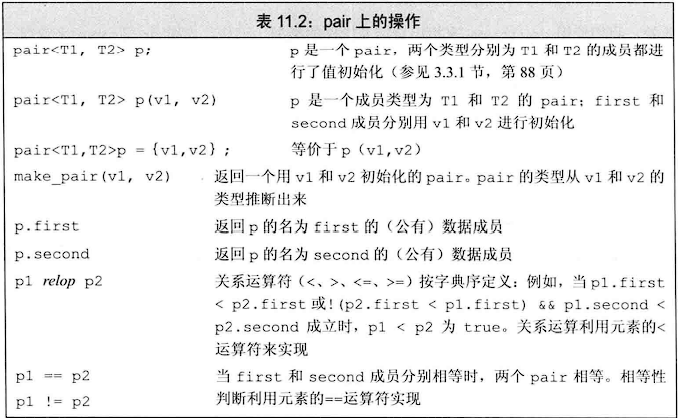
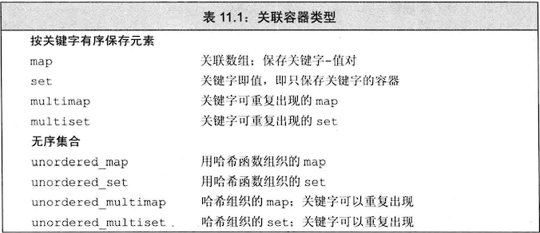
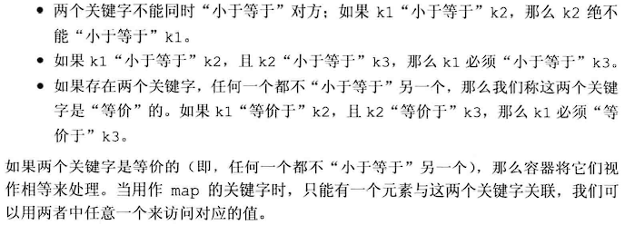
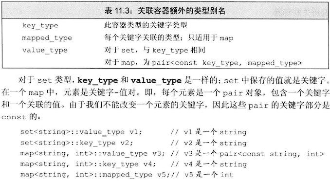
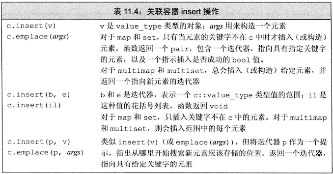
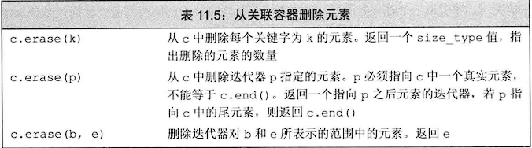
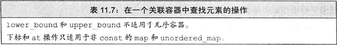
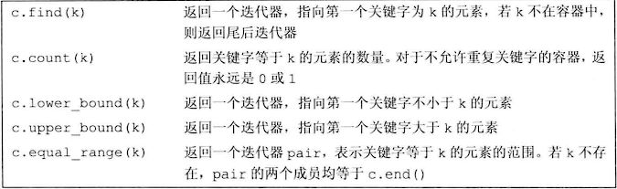

## 注意：

- 无序容器采用哈希函数来组织元素
- 有序容器定义在map和set头文件中，无需容器定义在unordered_map和unordered_set头文件中
- 关联容器迭代器都是双向的
- 有序容器的关键字必须定义比较的方法，默认使用小于运算符，定义比较的方法函数必须遵循严格弱序
- **只有map和unordered_map支持下标运算！**而且容器内不存在此关键字，则下标运算符会插入此关键字作为新元素，进行值初始化，**所以只有非const的容器才支持下标运算**
- **map中，关键字是const的！**
- 与顺序容器不同的是，**map的下标运算符返回的不是value_type，而是mapped_type，**即关键字对应的值类型。相同点是返回的是一个左值，可以进行读写
- set的迭代器虽然定义了const与非const类型，但是都只能用来访问元素，而不能用于修改元素值！**即set的迭代器只能是const！**
- 通常不对关联容器使用[[泛型算法]]
- **在multi容器中，相同关键字的元素相邻存储**
- 若关键字不存在，则lower_bound与upper_bound会返回关键字的第一个安全插入点——不影响容器中元素顺序的插入位置，也可以理解为若两函数返回值相同，则关键字不存在

## piar类型：

创建pair对象时，必须提供两个类型名，pair的默认构造函数对数据成员执行值初始化，**所有成员都是public的**

**map的元素类型就是pair**

**示例：返回pair对象的函数**

~~~c++
pair<string,int> function(vector<sting>& v)
{
    if(!v.empty())
    {
        //以下介绍了四种创建pair的方法
        return {v.back(),v.back().size()};//列表初始化，first为v的最后一个元素，second为v最后一个元素的大小
        //return make_pair(v.back(),v.back().size());
        //return pair<string,int>(v.back(),v.back().size());
        //pair<string,int> pst(v.back(),v.back().size());return pst;  
    }
}
~~~

