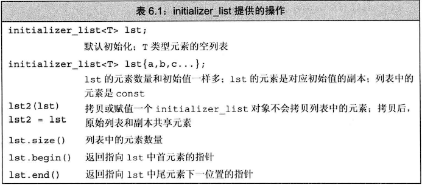

## 注意：

- 用于表示某种特定类型的值的数组

- 定义在同名头文件中

- **存放在里面的元素永远是const常量，无法被修改**

  ~~~c++
  initializer_list<int> l1{ 1,2,3,4 };
  
  auto it = l1.begin();
  *it = 3;//错误！初始值列表里的元素是常量，无法修改
  
  const int* p = &*it;//指向元素的指针因此也必须是常量指针
  ~~~
  
- 当用一个initializer_list对象给另一个initializer_list对象赋值或初始化时，**这两个对象共享元素，**而不是拷贝一份元素
  ~~~c++
  initializer_list<int> l1{ 1,2,3,4 };
  initializer_list<int> l2 = l1;
  auto it = l2.begin();
  auto it2 = l1.begin();
  cout << it << " " << it2;//输出结果，it与it2存放的地址是相同的，即指向同一对象
  ~~~

- 