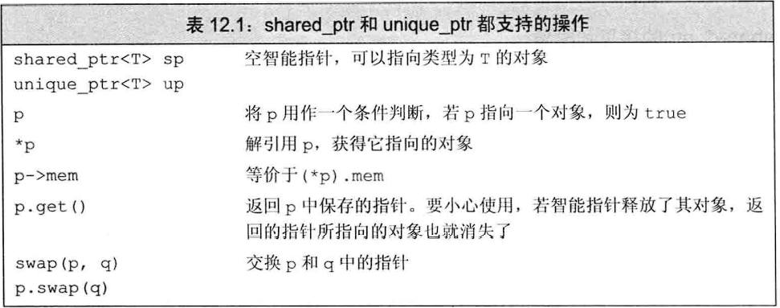
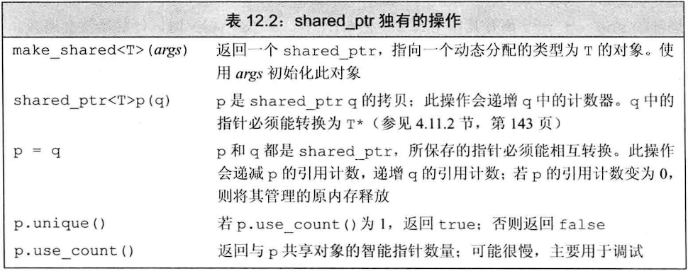

## 注意：

- **在C++中，动态内存的管理通过new与delete运算符，也可以使用智能指针**
- **智能指针是一个模板**
- **如果将shared_ptr对象寄放在一个容器中，而后不再需要全部元素，而只使用其中一部分，要记得使用erase删除不再需要的那些元素**

## 静态内存、栈内存和堆内存：

**静态内存：**用于保存局部static对象、类static数据成员以及定义在任何函数之外的变量

**栈内存：**用于保存定义在函数内的非static对象，由编译器自动创建或销毁。一定是一块连续的内存区域，栈的最大容量是由系统决定的，是向低地址增长的

**堆内存：**也称作自由空间或堆，用于存储动态分配的对象。是不连续的内存区域，操作系统使用链表进行管理，在X86系统上，堆是向高地址增长的。因为程序员通过频繁使用申请、释放操作必然会造成内存空间的不连续，产生大量碎片

## 使用动态生存周期的资源的类：

**一般出于以下三种原因之一：**

- 程序不知道自己需要多少个对象
- 程序不知道所需对象的具体类型
- 程序需要在多个对象间共享数据

## new与delete：

在自由空间分配的内存是无名的，因此new无法为其分配的对象命名，而是返回一个指向该对象的指针

int *p = new int;//返回一个指向int的指针，该指针指向一个无名的未初始化的int对象

**可以定义一个动态分配的const对象，和普通const对象一样必须进行初始化**

### 初始化动态分配的对象：

**默认情况下，动态分配的对象是执行默认初始化的，即内置类型对象的值是未定义的，类类型对象则执行默认构造函数**

**也可以使用直接初始化方式来初始化一个动态分配的对象。我们可以使用圆括号构造方式也可以使用列表初始化**

int *pi = new int(1024); string *ps = new int(5,'s');//ps指向对象的值为sssss vector<int> *pv = new vector<int>{0，1，2，3}；

**也可以进行值初始化，只需要在类型名后跟一个空的圆括号即可**

string *ps1 = new string;//执行默认初始化，空string string *ps1 = new string();//执行值初始化，空string int *pi1 = new int;//执行默认初始化，值是未定义的 int *pi2 = new int();//执行值初始化，值为0

**对于定义了默认构造函数的类类型来说，要求执行值初始化是没意义的，因为无论是值初始化还是默认初始化都是调用类的默认构造函数**

**如果一个依靠合成的默认构造函数的类类型中的内置类型成员没有提供类内初始值，则它们的值也是未定义的**

**如果我们提供了括号包围的初始化器，就可以使用auto从此初始化器中推演出我们想要分配的对象的类型，但是尽在单一初始化器时生效！**

auto *pi = new auto(9);//pi指向int类型的值为9的对象 auto *pv = new auto{0,1,2,3,4};//错误！无法推演！

## 智能指针：

**智能指针是一种模板**

**默认初始化的智能指针保存一个空指针**

**分为shared_ptr、unique_ptr、weak_ptr三种类型**

## shared_ptr类：

### make_shared函数：

**make_shared函数是标准库函数，它在动态内存中分配一个对象并初始化它，返回指向此对象的shared_ptr。这是最安全的分配和使用动态内存的方法**

**使用格式为make_shared<类型名>(初始值列表)，其中初始值列表的函数必须能用来初始化它指定的类型，如果不传递任何参数就将执行值初始化**

### shared_ptr的拷贝、赋值和引用计数：

**当进行拷贝和赋值时，每个shared_ptr都会记录有多少个其他的shared_ptr指向相同的对象**

**当进行拷贝时，计数器会递增**

**当赋予新值或是shared_ptr被销毁（例如一个局部shared_ptr离开其作用域）时，计数器会递减**

**一旦引用计数变为0，它就会自动调用析构函数以释放自己所管理的对象**

**如果将shared_ptr对象寄放在一个容器中，而后不再需要全部元素，而只使用其中一部分，要记得使用erase删除不再需要的那些元素**