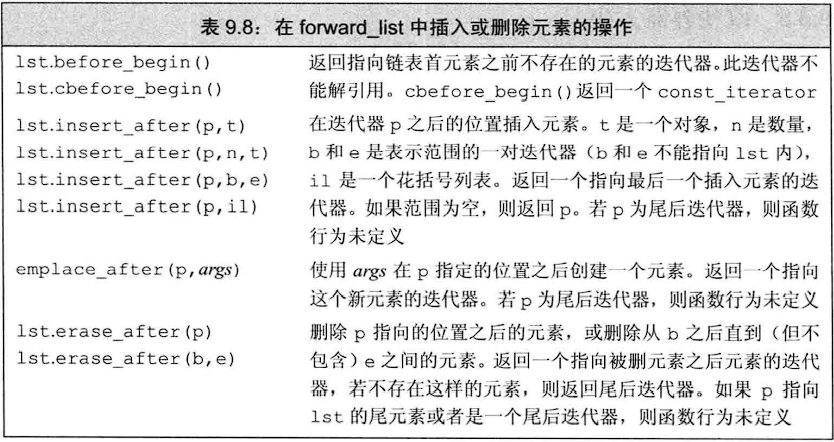

## forward_list特殊的操作

## 为什么forward_list提供特殊版本的增删操作：

当添加或删除一个元素时，删除或添加的元素之前的那个元素的后继会发生改变。为了添加或删除一个元素，我们需要访问其前驱，以便改变前驱的连接。但是，forward_list时单项链表。在一个单项链表中，没有简单的方法获取元素的前驱。出于这个原因，在forward_list中添加或删除元素的操作是通过改变给定元素之后的元素来完成的。这样，我们总是可以访问到被添加或删除所影响的元素。