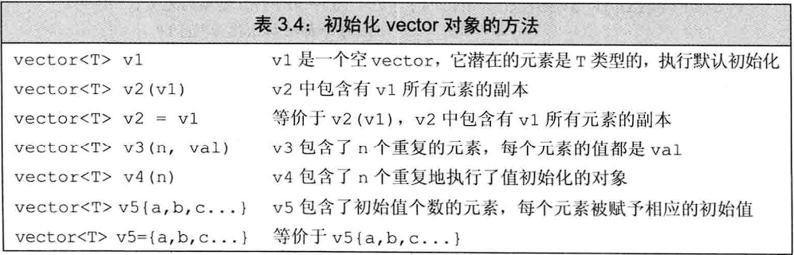
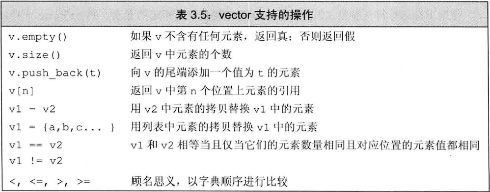

## 注意：

- vector表示对象的集合，大小可变
- **不建议在定义vector时设置大小，**因为vector对象能够高效增长，这样做可能还会使得性能更差
- **循环体内部有向vector对象添加元素的语句时，则不能使用范围for循环
- **size函数返回值是vector定义的size_type类型，它是一种无符号类型的值，并且能够存放下任何vector对象的大小**
- **只有当底层元素类型定义了比较方法时，vector对象才可以比较**
- **不能使用下标运算符添加元素！因为vector大小是动态的，给一个不存在的元素赋值是非法的**
- **下标运算符越界会访问非法内存区域，导致缓冲区溢出！**

## 定义和初始化vector对象：

**对于第5种构造初始化方法，如果忽略初始值，库会创建值初始化的元素初值。如果是内置类型则为0，如果是某种库类型，则执行默认初始化**

**使用花括号初始化时，如果提供的初始值不能用于初始化，在一定条件下会自动纠错，采取构造方式初始化。而圆括号不存在这个功能**（不忽略初值的情况下花括号前加上等号=也适用！待验证）

~~~c++
vector<string> v1(10);//v1包含10个空字符串
vector<string> v2{"yes"};//v2包含一个字符串，内容是"yes"
vector<string> v3("yes");//错误！
vector<string> v4{10};//显然，提供的初始值10是int类型，不能用于初始化string，则会考虑构造方式初始化。v4包含10个空字符串
vector<string> v5{10,"yes"};//显然，提供的初始值10是int类型，不能用于初始化string，则会考虑构造方式初始化。v5包含10个"yes"
vector<string> v6{10,"yes","no"};//错误！提供的参数既不能用于初始化，也不能用于构造
~~~

**使用数组初始化vector对象：只需指明拷贝区域的首元素地址和尾后地址即可**

~~~c++
int arr[] = {1,2,3,4};
vector<int> vi(begin(arr),end(arr));//vi内容为1234
~~~

## vector 的操作：

