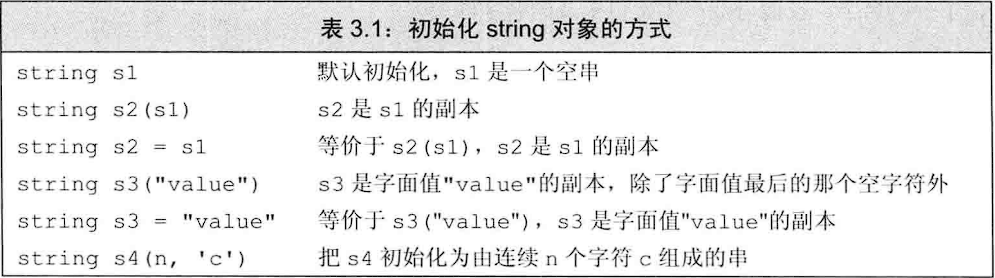
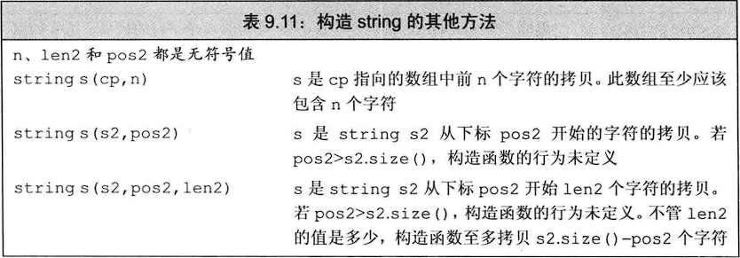
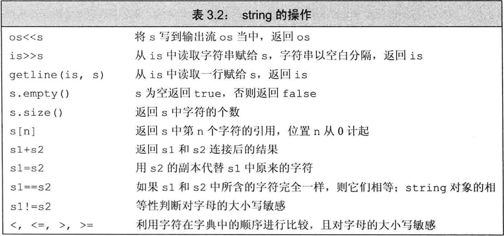
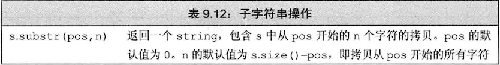
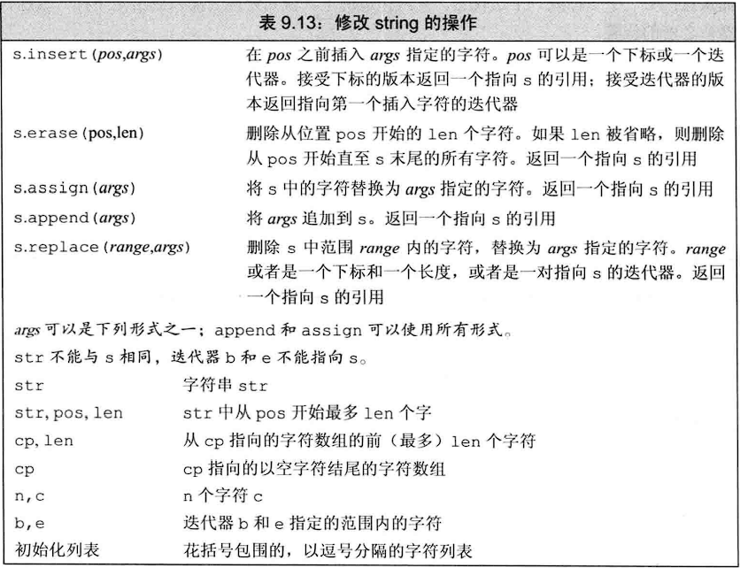
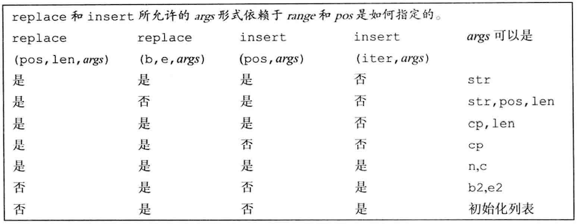
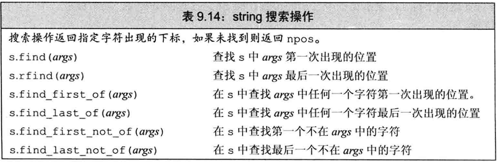
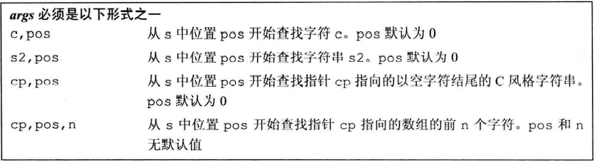
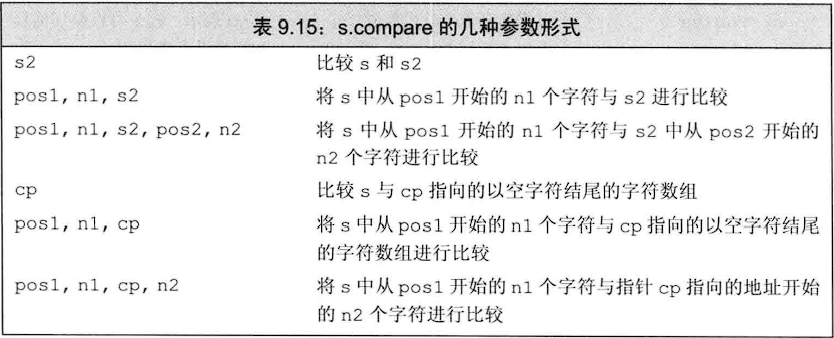
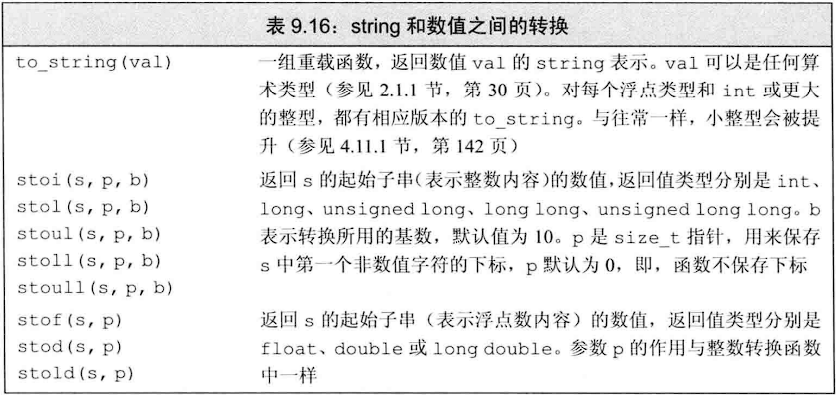

## 注意：

- string：可变长的字符序列

- **默认初始化的string为空字符串，占用一个字节，包含\0，可以用下标0访问**

- **C++11标准后，所有string均以\0结尾！**

- **string对象和空字符\0相加，行为合法但是不执行任何操作！容量也不会增加！**

- **可以使用下标访问结尾处的\0，同样也可以用迭代器和指针访问（即解引用end()），还可以赋值！但是赋值后仍然不算在string的内容里面(迭代器/指针访问仅在vscode生效，vs2022不行）；**

- **size函数不会计算末尾的空字符（修改空字符后也不计算！）**

  ~~~c++
  //此处代码是上述五条的示例
  string str;//未初始化，为空字符串
  cout << str[0];//输出空字符\0
  str = "123";
  cout << str[3];//输出末尾的空字符\0
  auto end = str.end();
  //以下代码仅在vscode生效，vs2022不行
  *end = 'a';//解引用并赋值给尾后迭代器所指的空字符\0
  cout << *end;//可以看到末尾的空字符\0已经被修改成了字符a
  cout << str[3];//同上一条语句
  cout << str;//只会输出123，不包括尾后迭代器所修改的内容
  cout << str[4];//错误！越界，由此可得到，修改尾后迭代器指向的空字符并不会改变string的大小，所以修改后string的最后就不是空字符了！
  ~~~

- 使用字符串字面值初始化string对象时，最后的空字符\0 不会被拷贝！应该说是只拷贝空字符之前的内容，即使空字符在字符串字面值中间也是，解释同下一条

- **使用字符串字面值或者字符数组为string对象赋值或者初始化时，只截取空白符\0（此规则只针对\0生效！空格制表符等不生效，且用户在cin中输入的\0不算空白符）的前段！**

  ~~~c++
  string s1("test\0test");//s1内容为"test"
  s1 = "yyy\0xxx";//s1内容为"yyy"
  cin >> s1;//如果输入"zz\0zz"
  cout << s1;//输出时"zzzz"
  ~~~

- **size函数返回值是string::size_type类型，它是一种无符号类型的值，并且能够存放下任何string对象的大小**

- **使用size函数返回值时，切记不要与带符号数混用！**

  ~~~c++
  int n = -1;
  string s(10,'c');
  return s.size() < n;//几乎肯定是true，因为带符号与无符号混用，带符号的n自动取模转换为一个很大的无符号数
  ~~~

- **两个string对象相加，返回值是将右侧对象追加在左侧对象的后面**

- **string对象可以与字符字面值或者字符串字面值相加，返回一个string对象。必须保证运算符两侧对象中至少有一项是string对象，因为字符串字面值和字符字面值不能直接相加**

- **上面一条的原理是标准库允许在string加法中把字符/字符串字面值转换为string对象**

- **string和字符串字面值不是同一种类型！！！**

## 定义和初始化string对象：

**使用数组初始化string时，若不提供计数值且数组并非以空字符结束，或者计数值大于数组的大小时，行为是未定义的**

**表9.11中第一个构造函数的参数cp是指数组名转换而来的指针，并非指向数组的指针**

**表9.11中的参数pos2如果越界，则会抛出out_of_range异常，len2大小没有要求**

## string的操作：

### 读写操作：

使用IO操作符输入string对象时，**对象会自动忽略开头的空白**（空格符、**换行符**、制表符），从第一个非空白有效字符读起，遇到第一个空白即停止

~~~c++
string str;
cin >> str;//如果输入"   Hello World"
cout << str;//输出"Hello"
~~~

string对象的IO操作也是返回左侧运算对象

string对象的IO操作也支持多个输入或者输出连在一起，当作为输入时，以空白符作为string对象间的分隔

~~~c++
string str1,str2;
cin >> str1 >> str2;//如果输入"  Hello    World  "
cout << str1 << str2;//输出HelloWorld，其中str1的输出是Hello，str2的输出是World
~~~

**注意：一下程序的输出有些出乎意料**

~~~c++
string s;
while (cin >> s)//如果输入" 111 222 33 4444 "
{
    cout << s;//输出的不是"111"，而是"11122334444"
}
~~~

**使用getline函数：参数是一个输入流和一个string对象。会保留输入时的空白，遇到换行符停止。如果第一个就是换行符，那么string对象就是空字符**

### 访问元素操作：

1. 范围for语句
2. 下标运算符
3. 迭代器

**下标运算符接受的参数类型为string::size_type，返回值是该位置元素的引用**

**使用下标运算符时如果越界将会产生不可预计的后果，对空字符使用也是**（后半句已失效！现在已经可以使用下标0访问空字符串）

**下标的最大值时size-1**

### 截取操作：

**如果开始位置参数越界，则会抛出out_of_range异常，计数值大小没有要求。两个参数都为无符号类型，如果实参为负数，会有意想不到的程序错误！！！**

**计数值大小过大的话，也最多截取到string的末尾**

**虽然开始位置和计数值参数都为可选的（含有默认实参），但是根据默认实参规则，只能同时省略或者只省略计数值**

### 添加/删除/替换操作：

**assign操作中，如果提供cp和len，则len的大小如果超过cp指向数组的大小也不会报错！但是会显式之后的内存空间中存放的数据**

**replace操作是调用erase和insert的一种简写形式**

**cp为字符数组名转换而来的指针，或者是一个const char\*类型的对象**

VS2022中:
迭代器b和e已经可以指向字符串本身！！！
replace(pos,len,初始化列表)已经可以使用！
insert(pos,cp)已经可以使用！
insert(pos,初始化列表)已经可以使用

### 搜索操作：

**每个搜索操作都返回一个string::size_type的值用于表示匹配位置的下标，如果搜索失败，则返回一个名叫string::npos的static成员。标准库将npos定义为一个const string::size_type类型，初始值为-1，因为它的类型为无符号类型，所以npos的初始值等于string的最大可能大小！**

### 比较操作：

**两个string之间，string和C风格字符串之间（应该是利用了string的转换构造函数）可以直接使用比较运算符进行比较**

**也可以使用string的compare成员函数进行比较**

### 与数值类型的转换操作：（这是标准库函数！并非成员函数）

**要转换为数值的string中第一个非空白字符必须是数值（十进制）中可能出现的字符！！！**

**如果string不能转换为一个数值，则会抛出invalid_argument异常**

**如果转换得到的数值无法用任何类型来表示，则抛出一个out_of_range异常**
