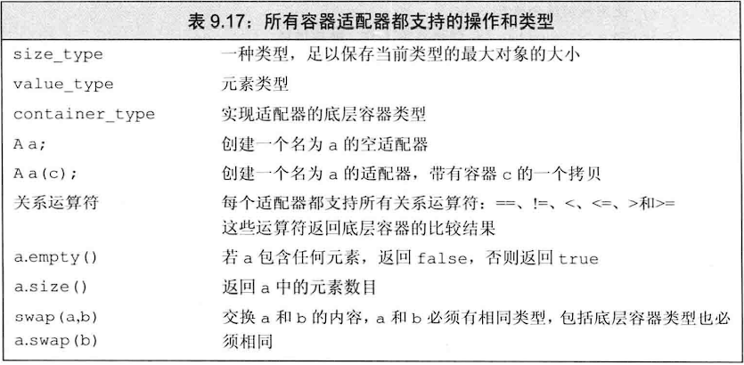

## 注意：

- **标准库定义了三个顺序容器适配器：stack、queue、priority_queue**

- **适配器：是一种机制，能使一种事物的行为看起来像另一种事物**

- **容器、迭代器和函数都有适配器**

- **容器适配器有两个构造函数，一个默认构造函数构造一个空对象，另一个构造函数接受一个容器参数用于拷贝初始化**

- **默认情况下，stack和queue是基于deque实现的，priority_deque是在vector之上实现的，但我们可以创建适配器时指定一个顺序容器作为第二个类型参数来重载默认容器类型**

  ~~~c++
  stack<string,vector<string>> svs;//创建了一个空的stack，底层容器类型为vector<string>
  stack<string,vector<string>> svs_2(svs);//创建了stack，初始值为svs的拷贝，底层容器类型为vector<string>
  ~~~

- **所有适配器都要求容器具有添加/删除元素和访问尾元素的能力，因此array和forward_list不能作为底层容器类型**

- **stack只要求push_back、pop_back和back操作**

- **queue要求back、push_back、front和push_front操作**

- **priority_deque要求除了front、push_back和pop_back操作之外还要求随机访问能力（下标访问）**

## 栈适配器：（定义在stack头文件中）