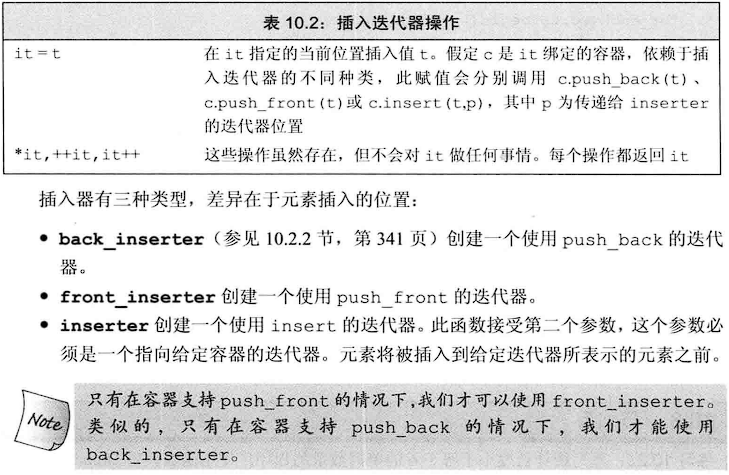
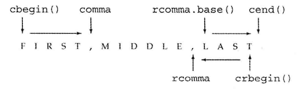
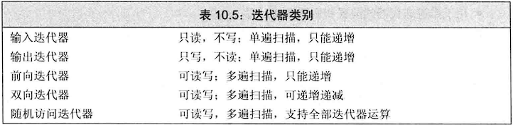
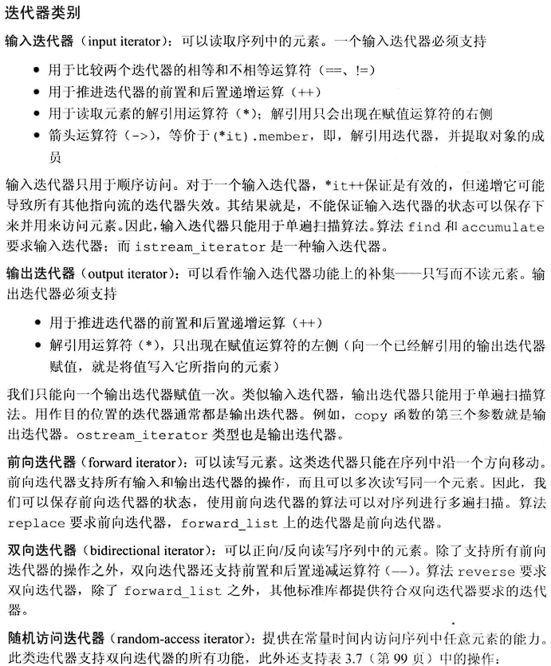
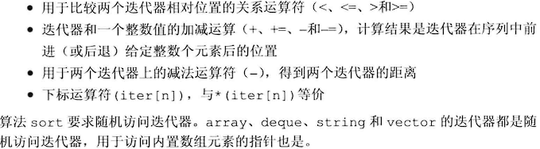

## 插入迭代器：<iterator>

**使用inserter插入迭代器插入元素时，插入顺序是倒序的**，执行过程相当于：

~~~c++
//如果it是有inserter生成的迭代器
*it = val;
//等价于
it = c.insert(it,val);//it现在指向新加入的元素
++it;//it现在指向原来的元素
~~~

## 流迭代器（待看）

## 反向迭代器：

除了forward_list都支持反向迭代器

将反向迭代器传递给sort函数可以使得序列变为递减

使用反向迭代器的base函数，可以将其转换为普通迭代器

## 迭代器类别

输入迭代器：==、!=、++、、->；

输出迭代器：++、；

前向迭代器：==、!=、++、、->；

双向迭代器：==、!=、++、–、、->；

随机访问迭代器：==、!=、++、–、、->、<、<=、>、>=、+、+=、-、-=、-、iter[n]、(iter[n])。