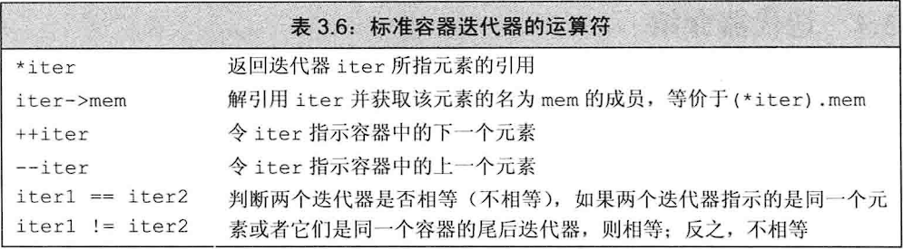
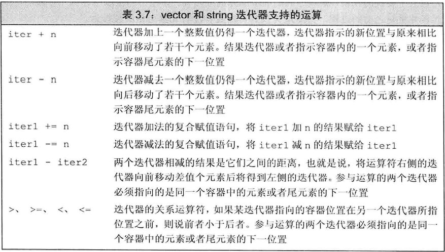
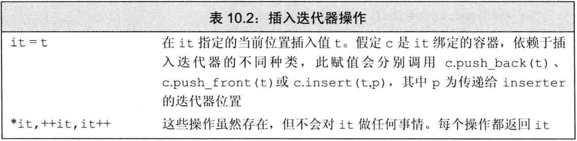

## 注意：

- **所有容器的迭代器都定义了==和!=，而大部分没有定义<运算符。**因此要养成使用!=的习惯

- **所有的标准库容器都有支持递增运算的迭代器**

- **显示使用const_iterator迭代器类型符定义迭代器，可以用begin和end对它进行赋值**

  ~~~c++
  string str{"zxm"};
  string::const_iterator cit = str.begin();//cit是一个const迭代器
  ~~~

- **begin和end既可以返回iterator也可以返回const_iterator，取决于容器是否是常量**

- **cbegin和cend只能返回const_iterator，不论容器是否是常量**

- **常量容器的迭代器只能是const_iterator类型**

  ~~~c++
  const string str{"zxm"};
  auto it = str.begin();//it是一个const迭代器
  string::iterator it2 = str.begin();//错误！begin返回const_iterator，不能赋值给普通iterator
  ~~~

- 迭代器相减返回的类型是容器类型定义的difference_type，这是一个带符号整型，因为距离可正可负

- **forward_list迭代器不支持递减操作！！！**

- **list和forward_list的迭代器不支持大于小于比较运算符！！！**

## 迭代器范围：

迭代器范围为左闭合区间，其标准数学描述为[begin，end)

**对构成范围的迭代器要求：**

- 同时指向同一个容器的元素或是同一个容器的尾后位置
- 我们可以反复递增begin来达到end，即end不在begin之前

## 标准库迭代器

**插入迭代器back_inserter：**

当我们调用插入迭代器进行赋值时，该迭代器调用容器操作来向给定容器的指定位置插入一个元素

