## 注意：

- **应该优先使用标准库容器而不是更原始的数据结构（比如内置数组）**
- **顺序容器都提供了快速顺序访问元素的能力，但是这些容器都有不同的性能折中：①向容器内添加或从容器中删除元素的代价；②非顺序访问容器元素的代价**
- **除了array外，其他的顺序容器都提供了高效灵活的内存管理**
- **string和vector将元素保存在连续的空间中，所以由元素下标来计算其地址是很快速的。但是在尾部之外的地方插入或删除元素就需要移动很多元素，有时候插入元素还可能需要重新分配内存空间，非常耗时！**
- **与其他顺序容器相比，list和forward_list需要的额外内存开销很大！**
- **deque支持快速随机访问，且在两端操作元素的顺序与list相当！**
- **forward_list和array是C++11新添加的**
- **forward_list设计目标是达到与最好的手写的单向链表数据结构相当的性能，因此它不支持size操作，因为保存或计算其大小会比手写链表多出额外开销**
- **对于除了forward_list的顺序容器而言，size保证是一个快速的常量时间的操作**
- **如果底层元素类型为没有默认构造函数的类类型，则必须提高元素初始化器**
- **forward_list迭代器不支持递减操作！！！**
- **关于顺序容器的迭代器操作见[[迭代器]]
- **使用顺序容器的类型别名成员时必须加上作用域运算符**
- **只有顺序容器的构造函数能接受大小参数！关联容器不支持**
- **除了无序关联容器都可以使用比较运算符，但是前提是元素类型需要支持比较运算符**
- **只有连续存储的动态大小容器才支持容器大小管理操作**
- **如果已经明确存放进容器（仅限string和vector）中的元素数量，可以在存放操作前进行reserve操作，能有效提高程序的运行速率**

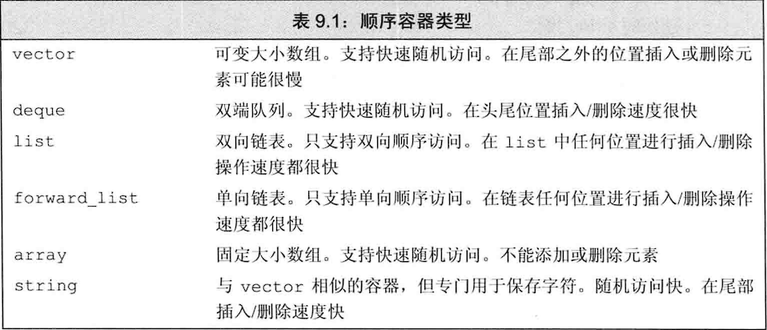

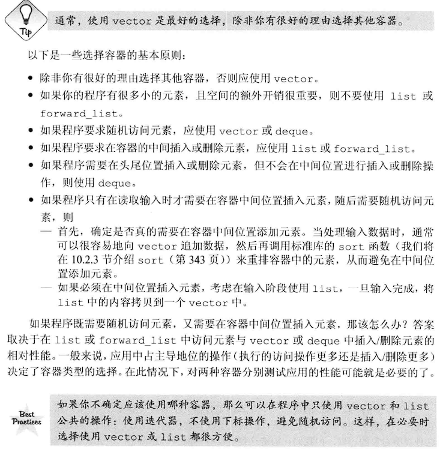

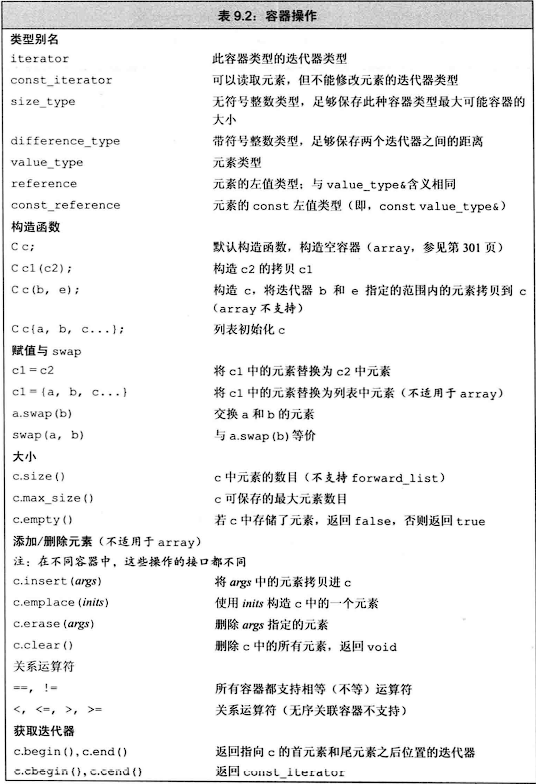

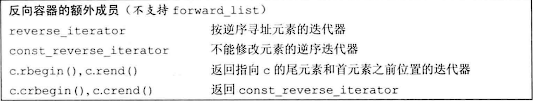

## 顺序容器定义和初始化：

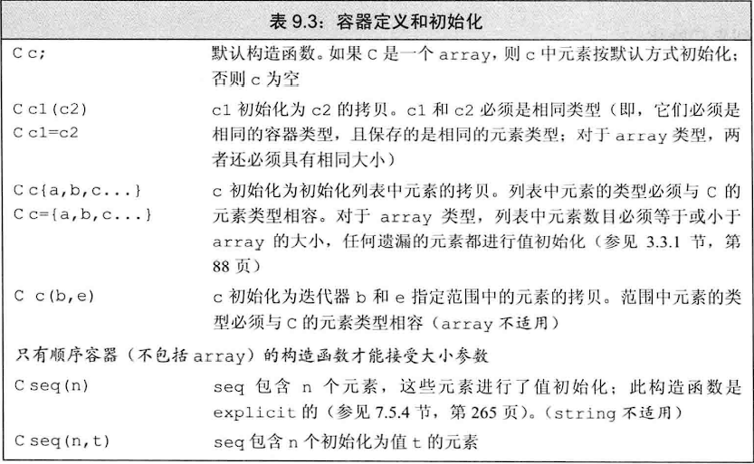

**使用迭代器版本的构造函数时，迭代器所指的容器底层的元素类型必须能转换成要初始化的容器的元素类型**

### 自动纠错的构造函数：

**使用花括号初始化时，如果提供的初始值不能用于初始化，在一定条件下会自动纠错，采取构造方式初始化。而圆括号不存在这个功能**

~~~c++
vector<string> v1(10);//v1包含10个空字符串
vector<string> v2{"yes"};//v2包含一个字符串，内容是"yes"
vector<string> v3("yes");//错误！
vector<string> v4{10};//显然，提供的初始值10是int类型，不能用于初始化string，则会考虑构造方式初始化。v4包含10个空字符串
vector<string> v5{10,"yes"};//显然，提供的初始值10是int类型，不能用于初始化string，则会考虑构造方式初始化。v5包含10个"yes"
vector<string> v6{10,"yes","no"};//错误！提供的参数既不能用于初始化，也不能用于构造
~~~

### array的特殊之处：

array和内置数组一样，具有固定大小，大小也是array类型的一部分，**因此定义对象时，不但要提供元素类型还需要指定大小**

**采用列表初始化时如果初始值数量小于array大小，则剩下的元素采用值初始化，因此，如果元素类型为类类型，则该类必须含有一个默认构造函数使得值初始化正常进行**

**array可以拷贝和赋值！这一点和内置数组不一样**

~~~c++
array<int, 4> ai{0, 1, 2, 3};
ai = { 0,1 };//ai得内容变为0100
array<int, 4> bi = ai;//拷贝方式初始化，必须注意类型完全相同（元素类型和大小）
~~~

## 顺序容器操作

### 添加元素：

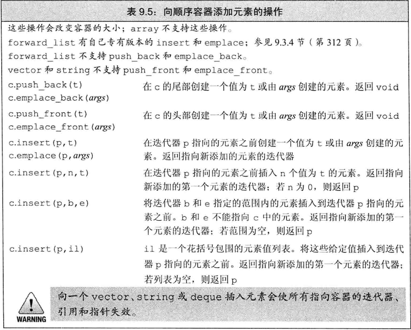

**除了array和forward_list，所有顺序容器都支持push_back（包括string）**
**只有list、forward_list、deque支持push_front**
**insert成员函数是将元素插入到迭代器所指定的位置之前，是因为迭代器很可能指向容器尾后不存在元素的位置，且在容器开始位置插入元素很有用**
**如果要给insert传入一对迭代器，它们不能指向添加元素的目标容器！**
**调用emplace时，是将参数传递给元素类型的构造函数。emplace成员直接在容器管理的内存空间中构造元素，所以参数必须与元素类型的构造函数匹配！**

### 访问元素：

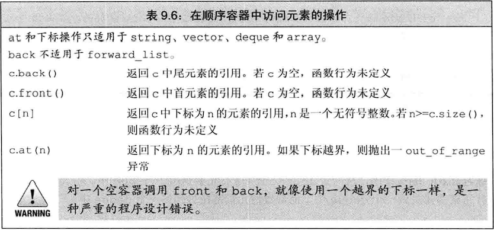

**所有顺序容器都支持front！而forward_list不支持back**

**对空容器不能使用back()和front()成员！！！**

**访问成员函数返回的都是引用！如果容器是const对象，则返回值是const的引用**

**因为返回的是引用，所以在使用auto自动类型时，推演类型为元素类型，而不是该元素的引用，如果需要推演为引用，记得显式添加引用修饰符&**

### 删除元素：

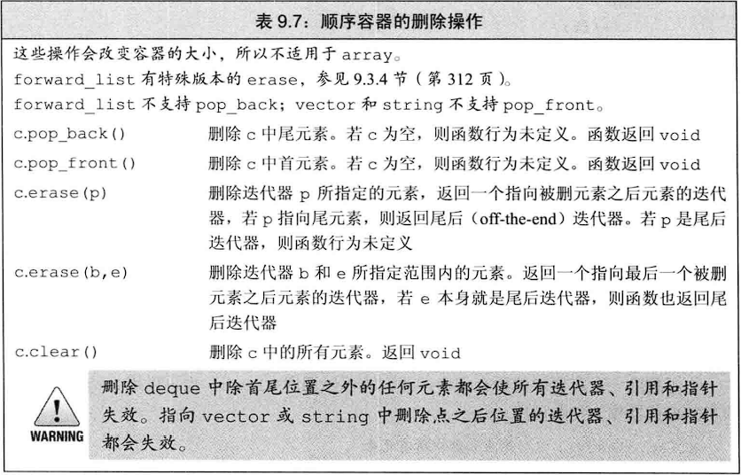

**删除元素的成员函数并不会检查其参数，**所以在删除元素之前，必须确保该元素是存在的！

vector和string不支持pop_front

forward_list不支持pop_back

**不能对空容器执行pop操作**

### 复制和swap：

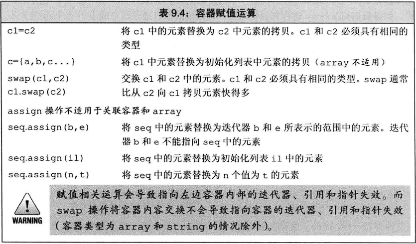

使用赋值运算符后，左边容器的内容将被替换为右边容器中的内容，且左边的大小变为和右边大小一样（array除外）

**对于array，赋值如果采用花括号包围的值列表，则值得数量必须小于等于array的大小，规则和初始化array一样，如果值数量小于大小，则剩下的采用默认初始化**

**swap通常比拷贝快得多**

**assign操作不支持array和关联容器**

**swap操作不会使得容器内的指针迭代器或引用失效（array和string除外），在swap操作后，指向的对象没有改变，但是指向的容器改变了**

~~~c++
vector<int> v1{ 0,1,2 };
vector<int> v2{ 3,4,5 };
auto it = v1.begin();
cout << *it;//输出0
swap(v1, v2);
cout<< *it;//输出0，但是it已经变更为指向v2的首元素
~~~

**赋值运算符要求两侧对象类型相同，而assign没有这个要求，只要元素类型可以转换即可**

**除了array外，swap不对任何元素进行拷贝、删除或插入操作，因此可以保证在常数时间内完成**

**使用swap对array进行操作时，会真正地交换两个array的元素，因此耗时与array大小成正比**

### 容器大小操作：

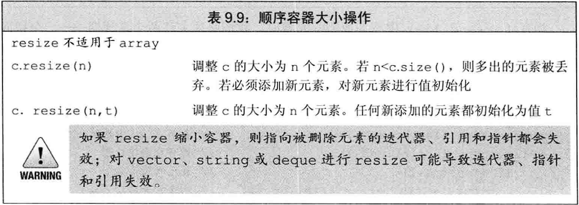

**使用resize添加元素时，新元素执行值初始化，类类型元素类型必须含有默认构造函数或者手动提供初始值**

**resize只会改变元素数量，不会影响容器容量！**

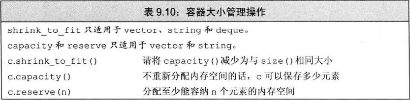

**只有连续存储的动态大小容器才支持容器大小管理操作**

**当传递给reserve的参数n小于或等于capacity时，reserve什么操作都不会做，如果n大于capacity，则reserve至少分配n一样大的内存空间（可能比n更大）。因此，reserve调用结束后，capacity一定大于等于n**

**shrink_to_fit操作只是一个请求，编译器可以忽略该请求！**

## 容器操作合适导致迭代器失效：

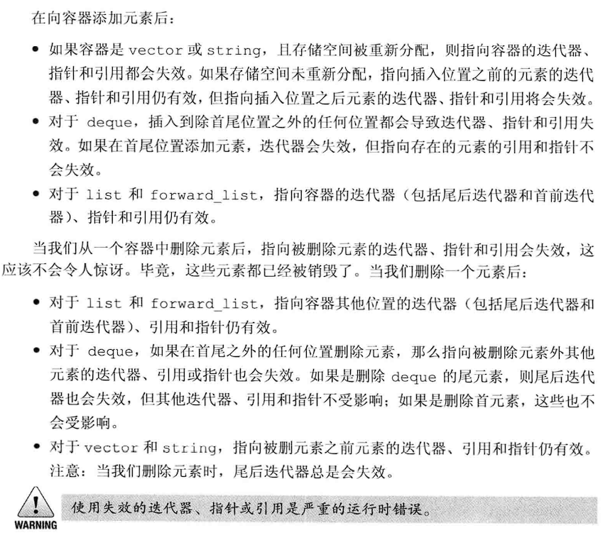

### vector内存分配策略（vector对象是如何增长的）：

**如果没有空间容纳新元素，容器必须分配新的内存空间来保存已有元素和新元素，将已有元素从旧位置移动到新空间中，然后添加新元素，释放旧存储空间。当不得不获取新的内存空间时，vector和string的实现通常会分配比新的空间需求更大的内存空间。容器预留这些空间作为备用，可以用来保存更多的新元素。这样就不需要每次添加元素都重新分配内存空间了**

尽管每次重新分配空间都要移动所有元素，但是用该策略后，其扩张操作通常比list和deque还要快！

**每个vector都可以选择自己的内存分配策略。但是都必须遵循一条原则，只有在迫不得已时才能重新分配内存空间。从技术层面上说，必须确保push_bak向vector添加元素的操作有高效率，通过在一个空vector中不断使用n次push_back所耗费的时间不能超过n的常数倍**